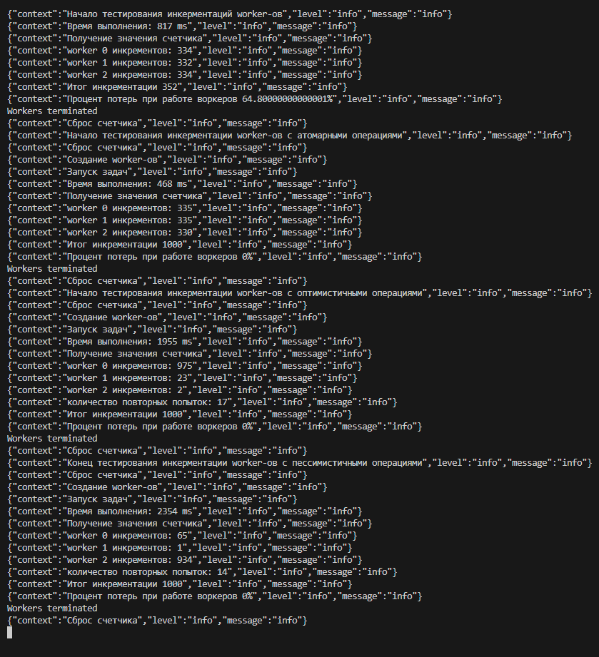

Тестовое приложения для показа прблем с race condition и методом их решений

Требоавния для запуска:
docker-compose
node 
Установка зависимостей:
npm i 
Настройка MongoDB:
docker-compose up
Запуск:
npm run start:dev

Описание проблемы race conditions

Что это такое:
Race condition - ситуация, когда результат работы программы зависит от порядка или времени выполнения нескольких параллельных операций.

Когда возникает:
Возникает при одновременном доступе к общим данным (например, при записи в БД, обновлении состояния или работе с кешем) без должной синхронизации.

Почему это критично:
Может привести к непредсказуемому поведению приложения: потере данных, дублированию записей или ошибкам логики. В распределённых системах такие баги часто проявляются редко, но имеют серьёзные последствия.

Результаты тестирования:

Изб 1 Статистика по разным инкрементациям воркеров

1 кейс (без защиты от race condition)
1) Время исполнения: 849-ms
2) Процент потерь: 65.8%
3) Распределение по воркерам: 333/334/333

У первого кейса все хорошо с распределением задач по worker-ам но процент потерь(2/3 инкрементов просто не доходят до бд) и скорость оставляют желать лучшего

2 кейс (с использованием атомарных операций)
1) Время исполнения: 465-ms
2) Процент потерь: 0%
3) Распределение по воркерам: 333/333/334

Второй кейс самый оптимальный по времени - 443ms в рамках простейшей инкрементации и отсуствия бизнес логики, у него всегда 0 процент потерь, быстрая скорость исполнения и отличное распределние по воркерам

3 кейс (с использованием оптмистичной стратегии)
1) Время исполнения: 465-ms
2) Процент потерь: 0%
3) Распределение по воркерам: 959/18/23
4) Количество повторных попыток 

Выводы: